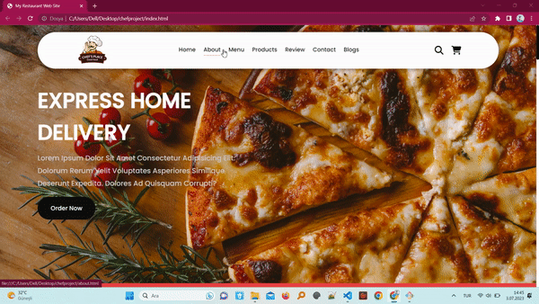

<h1>Restaurant Project</h1>

This project is a sample of Restaurant websites. It is a connection between customers and restaurant.

<h2>The technologies that are used in this project.</h2>
Html and Css and Javascript are used in this project.

<h3>the Aim of the project</h3>

my aim for this project is being creative, functional and readable. 

<h3> Screen GIF</h3>

